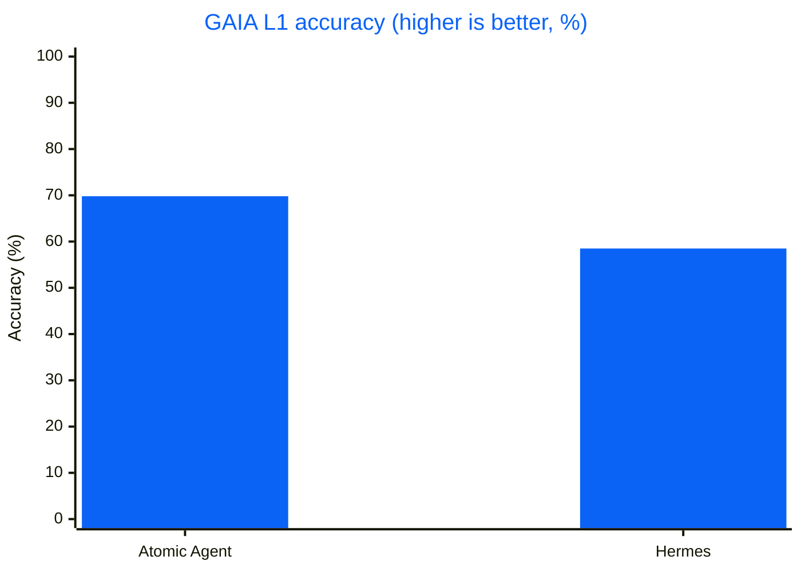
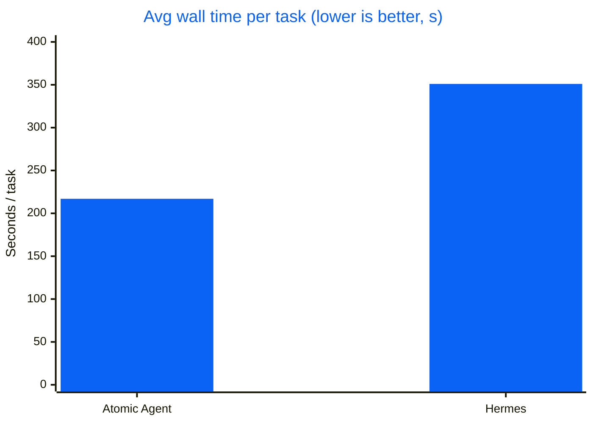
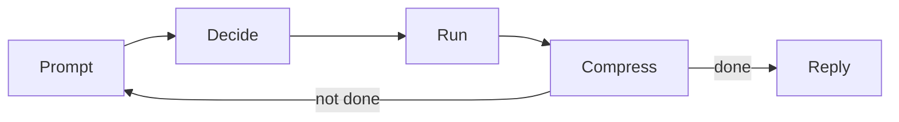

<div align="center">


# Atomic Agent

### A local-first AI agent that runs on your machine, with local or cloud models.

Drives your browser, edits files, runs approved commands, and remembers context across sessions. Open source, running on our TurboQuant `llama.cpp` for +30-50% throughput on small local models.

[](#benchmarks)
[](https://github.com/AtomicBot-ai/atomic-agent/actions/workflows/release.yml)
[](https://github.com/AtomicBot-ai/atomic-agent/releases)
[](package.json)
[](LICENSE)
[](https://nodejs.org/)
[](https://www.typescriptlang.org/)


**[Quick Install](#quick-install) · [Benchmarks](#benchmarks) · [Why Local-First](#why-local-first) · [Ways to Use It](#ways-to-use-it) · [Docs](#development)**


</div>

---

A local-first AI agent that runs the control loop and all state on your machine. It drives your desktop: browse, read and edit files, run approved shell commands, inspect documents, remember context across sessions, schedule follow-ups, and call external tools over MCP. Embed it in your own apps over HTTP or a Tauri sidecar. `llama.cpp` first, so small quantized models stay useful for long, multi-step work on consumer hardware.

## Quick Install

macOS / Linux:

```bash
curl -fsSL https://atomicagent.io/install | sh
```

Windows (PowerShell):

```powershell
irm https://atomicagent.io/install.ps1 | iex
```

The installer downloads the release archive, verifies the checksum, and installs the CLI plus support assets (`grammars/`, native prebuilds, and bundled `ripgrep`). Atomic Agent updates itself in place; after an update the TUI prompts you to restart.

> [!NOTE]
> Developer preview. APIs, commands, config, and behavior are still moving, so pin a release if you need a stable integration point. Current builds: macOS (Apple Silicon), Linux x64 / arm64, and Windows x64.

### Run

```bash
atomic-agent
```

> [!TIP]
> Coming from Hermes or OpenClaw? Run `/import` in the TUI for a one-shot migration: sessions, cron jobs, and optionally your provider keys.

### Troubleshooting

If something isn't working:

1. Copy your error logs and system specs.
2. Open an issue on [GitHub](https://github.com/AtomicBot-ai/atomic-agent/issues).
3. Or ask for help in our [Discord](https://discord.com/invite/Us7qXtDGw).

## Talk to Us

Building something with Atomic Agent, stuck on setup, or just want to share what you are working on? Grab a slot and talk to the team directly: **[cal.com/atomicagent/demo](https://cal.com/atomicagent/demo)**. No agenda required. Questions, feedback, feature requests, or a plain hello all count. We read every issue and every Discord message too, but sometimes a 15-minute call beats a week of comments.

## Benchmarks

On the public **GAIA validation Level 1** split (53 tasks), Atomic Agent and Hermes drove the **same** local `qwen-3.6-35b-a3b` (`llama-server`, UD-Q4_K_XL), with the same step budget and timeout. The only variable is the agent loop.


| Metric | Atomic Agent | Hermes |
|---|---|---|
| **Accuracy** | **37/53 = 69.8%** | 31/53 = 58.5% |
| Avg wall / task | **~217 s** | ~351 s |
| Head-to-head wins | **+15 atomic-only** | +9 Hermes-only |

<details>
<summary><b>Charts (accuracy &amp; speed)</b></summary>





</details>

### Model Scaling

The same loop holds up as the local model shrinks. Same GAIA L1 split, Atomic Agent alone:

| Chat model | Accuracy | Avg wall / task |
|---|---|---|
| `qwen-3.6-35b-a3b` (UD-Q4_K_XL) | **37/53 = 69.8%** | ~217 s |
| `qwen-3.5-9b` (Q4_K_M) | **28/53 = 52.8%** | ~152 s |
| `gemma-4-12b` (it-qat UD-Q4_K_XL) | **24/53 = 45.3%** | ~423 s |

Even a 9B model clears half of GAIA L1 through the same context-frugal loop. (Different Atomic Agent versions per row; see the write-up for provenance.)

Full reproducible write-up: [`GAIA-L1-EXPERIMENT.md`](eval-agents/docs/GAIA-L1-EXPERIMENT.md) · Raw artifacts (matrices, NDJSON traces, logs): [gaia-l1-eval-2026-06-11 release](https://github.com/AtomicBot-ai/atomic-agent/releases/tag/gaia-l1-eval-2026-06-11).

## Why Local-First

The control loop and all state run on your machine, not a hosted service:

- **State lives on your disk.** Sessions, memory, tasks, traces, skills, browser profile, config, and `.env` secrets live under `<stateDir>` as plain files and SQLite databases. See [Privacy and Egress](#privacy-and-egress) for what can leave the machine and how to switch it off.
- **No API costs.** Run quantized models locally through `llama.cpp`. Bring your own `llama-server` or let the CLI manage one.
- **Nothing is hidden.** Inspect the prompt, replay trace drift, edit skills, and swap parts without waiting for a vendor. Plain local models, SQLite files, and NDJSON traces.
- **Runs on your hardware.** Small quantized models run on everyday consumer GPUs and CPUs, no datacenter needed.

## Core Idea

### How the Agent Loop Works

An agent is a loop: the model picks an action, something runs it, the result feeds back in, and it repeats until the job is done. The catch is cost. Every turn re-sends the growing context through the model, so a naive loop gets slower and pricier each pass, and small local models choke on it fastest.

Atomic Agent keeps the loop cheap. One inference produces one JSON array of tool calls, and it runs them without re-encoding the whole world every turn:



1. **Prompt:** a compact prompt goes to the local model.
2. **Decide:** the model returns one JSON array of tool calls, grammar-checked so the format is always valid.
3. **Run:** the core executes them; independent reads run in parallel, risky actions ask first.
4. **Compress:** results and state are summarized, not pasted back in full.
5. **Repeat:** loop again until reply, finish, cancel, or a max-step limit.

The model chooses actions. Atomic Agent owns the loop, the state, the approvals, the traces, the stop conditions, and the failure boundaries.

### Built to Make Local Models Work

We run local models on our own TurboQuant `llama.cpp` ([`AtomicBot-ai/atomic-llama-cpp-turboquant`](https://github.com/AtomicBot-ai/atomic-llama-cpp-turboquant)):

- **TurboQuant KV-cache:** WHT-rotated low-bit quantization compresses the KV-cache up to ~6.4× versus F16, with a fused Metal decode kernel, so long-context sessions fit in far less memory.
- **TurboQuant weights:** Lloyd-Max weight quantization with WHT rotation and fused Metal/Vulkan kernels keeps quality usable while small models fit on consumer hardware.
- **Custom speculative decoding:** purpose-built Gemma 4 MTP and Qwen 3.6 NextN heads reuse the loaded model (no second context, tokenizer, or model load) for +30-50% throughput.
- **Curated quantized models:** hand-picked GGUF quants that keep quality usable while fitting real VRAM budgets.
- **Managed mode:** the CLI downloads, pins, and runs the backend and models for you, no manual `llama.cpp` setup.

### Tuned for Small Local Models

Atomic Agent's prompt is engineered so a small model never wastes tokens or breaks format:

- **Stable prefix:** persona, rules, tools, skills, capabilities, and instructions stay byte-stable inside a session so `cache_prompt` and `slot_id` can reuse KV-cache instead of re-encoding the prompt every turn.
- **Bounded tail:** conversation, memory, world state, recalled notes, lessons, procedures, and loaded skill bodies are clipped into a predictable prompt budget.
- **Externalized state:** sessions, memory, tasks, skills, traces, browser snapshots, and model config live outside the prompt.
- **GBNF tool calls:** completions are constrained into a JSON array of tool calls, including the solo case `[{...}]`.
- **Parallel read batches:** independent read-only calls can run concurrently after a single inference; dangerous actions remain approval-gated.
- **Compact browser view:** ordinary web operation uses accessibility / ARIA snapshots clipped to a character budget (24k by default) instead of screenshot-heavy page dumps.

This is why small local models can stay useful across long, tool-heavy work.

## What It Can Do

Atomic Agent drives a full desktop tool surface. Dangerous actions are routed through approvals; independent read-only calls run in parallel.

| Area | Capabilities |
|---|---|
| **Browser** | Navigate, click, type, search, manage tabs, scroll, and read compact ARIA state via `playwright-core` (Chrome / Edge / Chromium). |
| **Web & HTTP** | Web search with configurable providers (Exa, DuckDuckGo, Brave, SearXNG); fetch and extract pages or make arbitrary HTTP requests, both SSRF-guarded, separate from the browser. |
| **Filesystem & shell** | Read, write, edit, patch, glob, grep, diff, watch, hash, list, archive extract, run approved shell commands, and inspect or kill processes. |
| **Desktop** | Clipboard read/write, desktop notifications, and window list/focus. |
| **Documents** | Extract text locally from PDF, DOC, DOCX, XLSX, PPTX, ODT, RTF, and plain text. |
| **Git** | Read-only status, log, diff, show, blame, and branch inspection. |
| **Memory** | Profile facts, notes with hybrid recall, links, lessons, procedures, voting, and reflection. |
| **Tasks** | Durable deferred turns, cron schedules, intervals, webhooks, and agent-created reminders. |
| **Skills** | View and run Markdown skill playbooks (scripts are approval-gated), install more from ClawHub. Ships with 17 starter skills (Docker, GitHub, Notion, Obsidian, PDF, and more), auto-installed on first run. |
| **Vision** | Optional `vision.describe` for multimodal models with `mmproj`, kept outside the text transcript. |
| **MCP** | Connect external MCP servers; their tools, resources, and prompts join the same registry. |
| **Providers** | Local `llama-server` by default; OpenAI-compatible, OpenRouter, and AI/ML API providers when configured, with live model catalogs and mid-session switching. Reasoning-only completions from reasoning models are recovered instead of failing the turn. |
| **Telegram** | Single-user remote control with owner pairing, inline approval buttons, and opt-in result reports from scheduled tasks. |

### Memory That Grows Outside the Prompt

Atomic Agent's memory is not a giant chat log pasted back into the prompt. It's a local, inspectable store: durable identity, episodic notes, associations, distilled lessons, and reusable procedures. The prompt sees compact pointers, and full bodies are recalled by tool call only when the agent needs them.

- **Profile facts** render into `### profile` with contextual keyword gating; facts are versioned, with queryable history.
- **Notes** are stored in SQLite + FTS5, optionally paired with embeddings for hybrid recall.
- **Links** connect related memories into a bounded graph.
- **Lessons** distill repeated episodes into reusable principles.
- **Procedures** distill how-to templates without auto-executing them.
- **Voting** lets useful or harmful memories, lessons, procedures, and profile facts drift up or down.
- **Dedup and eviction** merge near-duplicate memories and evict by usefulness, not age, on by default.
- **Reflection** runs after turns, off the main agent slot, and writes memory without blocking the reply.

## Ways to Use It

<details>
<summary><b>TUI and CLI</b></summary>

Use the CLI for simple sessions, automation, and debugging. Use the TUI for an interactive control console: approvals, logs, models, skills, tasks, memory, MCP, Telegram, and traces.

```bash
atomic-agent run --cwd /path/to/work
atomic-agent tui --cwd /path/to/work

atomic-agent skill list
atomic-agent task list
atomic-agent trace list --limit 10
```

Handy slash commands: `/help` lists every command, `/tools` lists the built-in tool families, `/model` jumps to the LLM panel and reopens the model picker for the active cloud provider, `/privacy` shows what leaves the machine (`/privacy analytics off` turns analytics off). The chat log scrolls with PgUp / PgDn (fn+arrows on macOS).

Cloud provider setup pulls each provider's full live model catalog, hundreds of models, instead of a short hardcoded list; OpenAI-compatible servers are asked for their own `/v1/models`. The picker filters as you type, and `/model` switches models mid-session.

</details>

<details>
<summary><b>Managed local models</b></summary>

The CLI can manage a paired `llama.cpp` setup for chat and embeddings:

```bash
atomic-agent models update
atomic-agent models list
atomic-agent models pull qwen-3.5-4b
atomic-agent models use qwen-3.5-4b

atomic-agent models list-embeddings
atomic-agent models pull-embedding <model>
atomic-agent models use-embedding <model>

atomic-agent models start

atomic-agent tui --cwd /path/to/work
```

Managed mode downloads the backend, pulls GGUF models, selects the active model, and starts detached chat / embedding daemons when configured.

The managed chat daemon stops when the last session exits, freeing the RAM and VRAM the model was holding; set `localModels.managed.stopOnExit: false` in `config.json` to keep the model warm between sessions. Daemons started standalone with `models start` are never touched.

</details>

<details>
<summary><b>External <code>llama-server</code></b></summary>

Already have your own `llama.cpp` process? Point `atomic-agent` at it:

```bash
export ATOMIC_AGENT_LLAMA_URL=http://127.0.0.1:8080

./llama-server -m Qwen3.5-9B-Q4_K_M.gguf \
  --slots 4 \
  --parallel 4 \
  --port 8080 \
  --cache-reuse 256

atomic-agent tui --cwd /path/to/work
```

The LLM tab in the TUI has an External pane for this setup. Saving a URL runs an honest health probe: it validates the `/health` body, reports llama.cpp's 503 answer while a model loads as loading rather than dead, and recognizes when the URL is a different OpenAI-compatible runner that should be added as a cloud provider instead.

</details>

<details>
<summary><b>Ollama and LM Studio (local)</b></summary>

Running models under [Ollama](https://ollama.com) or [LM Studio](https://lmstudio.ai)? Both are OpenAI-compatible servers, and both are presets in the provider wizard, so there is no base URL to type.

```bash
ollama serve
ollama pull qwen2.5:0.5b

atomic-agent tui --cwd /path/to/work
```

In the TUI, open the LLM tab, add a provider, and pick **Ollama (local)** (or **LM Studio (local)**). A local server has no API key, so the wizard skips the key screen and goes straight to the model choice: two screens, service then model.

Model ids are the tags the server reports, `qwen2.5:0.5b` or `llama3.2:latest` for Ollama, so use the same name you passed to `ollama pull`. The list comes from the server's own `/v1/models`, which means anything you have pulled shows up without a restart.

**New in v0.2.1**: The provider wizard now includes a dedicated **Ollama (local)** preset that auto-detects your local Ollama server and provides a streamlined setup experience.

| Preset | Endpoint |
| --- | --- |
| Ollama (local) | `http://localhost:11434` |
| LM Studio (local) | `http://localhost:1234` |

Two things to know. Ollama's OpenAI-compatible surface lives under `/v1`, but the base URL is stored without it, since every call site appends `/v1/...` itself. And **Ollama (local)** is a different entry from **Ollama Cloud**: the first is the server on your machine and needs no key, the second is the hosted endpoint.

Tool calling works over this path, so the agent loop runs normally, but it is only as reliable as the model you picked. Very small models emit malformed tool calls more often; if the loop stalls, try a larger one before assuming the provider is at fault.

</details>

<details>
<summary><b>OpenAI-compatible HTTP</b></summary>

Run `atomic-agent` as a local HTTP service:

```bash
atomic-agent serve \
  --host 127.0.0.1 \
  --port 8787 \
  --cwd /path/to/work \
  --api-key "$ATOMIC_AGENT_API_KEY"
```

`POST /v1/chat/completions` maps one request to one full macro-turn: `user -> 0..N tool steps -> reply`. Atomic-specific routes expose sessions, approvals, tasks, webhooks, events, skills, config, and capabilities.

</details>

<details>
<summary><b>Tauri sidecar</b></summary>

The sidecar speaks newline-delimited JSON over stdio, making it easy to embed in desktop apps:

```json
{"kind":"request","id":"r-1","type":"start_session","payload":{"workingDir":"/home/me"}}
{"kind":"request","id":"r-2","type":"send_message","payload":{"sessionId":"s-1","text":"Check the inbox and summarize urgent mail."}}
```

Events stream back as the turn runs:

```json
{"kind":"event","id":"e-1","type":"turn_started","correlationId":"r-2","payload":{"sessionId":"s-1","turnIndex":0}}
{"kind":"event","id":"e-2","type":"tool_call_result","correlationId":"r-2","payload":{"sessionId":"s-1","stepIndex":0,"tool":"browser.read_aria","status":"ok","summary":"url: https://mail.google.com/ ..."}}
{"kind":"event","id":"e-3","type":"assistant_reply","correlationId":"r-2","payload":{"sessionId":"s-1","text":"You have 3 urgent threads."}}
```

</details>

<details>
<summary><b>Telegram remote control</b></summary>

Enable a personal Telegram bot and drive the same agent from your phone:

```jsonc
// <stateDir>/config.json
{
  "telegram": { "enabled": true, "ownerUserId": null }
}
```

```bash
# <stateDir>/.env
TELEGRAM_BOT_TOKEN=123456789:AA-your-bot-token
```

The TUI can store the token, start the channel, open pairing mode, and show status. Approvals arrive as inline buttons in your DM. Telegram is intentionally single-user.

While a turn runs, the bot keeps one live progress bubble updated in place. It is sent silently and shows step labels only, never tool output; turn it off with `"telegram": { "progressIndicator": false }`.

Scheduled tasks can report back to the same chat: create a cron job with `atomic-agent task create --cron "0 9 * * *" --message "morning digest" --notify telegram` (or ask the agent to schedule with `notify: "telegram"`), and each run posts its final result to your paired DM when it finishes. Reporting is strictly per-task opt-in, and the report's result text is sent to Telegram's servers; when the channel is down or unpaired the report is skipped with a logged warning and the task itself is unaffected.

</details>

<details>
<summary><b>MCP client</b></summary>

Configure MCP servers in `config.json`, and their tools join the same registry as local tools. Trusted read-only servers can batch with other reads; untrusted servers default to approval-gated execution.

```jsonc
{
  "mcp": {
    "servers": [
      {
        "name": "docs",
        "enabled": true,
        "transport": {
          "kind": "stdio",
          "command": "npx",
          "args": ["-y", "@example/mcp-server"]
        },
        "trust": "pure_read"
      }
    ]
  }
}
```

The TUI MCP panel supports live add / remove without restarting the process. When a stdio server fails to connect, the tail of its stderr is surfaced in the error instead of a bare disconnect message.

</details>

## Safety and Observability

Everything Atomic Agent does is inspectable and interruptible:

- **Approval gates:** shell, filesystem writes, patches, archive extraction, process kill, HTTP requests, skill scripts, and untrusted MCP tools are gated by policy.
- **Append-only traces:** prompts, completions, tool invocations, outcomes, failure categories, votes, and lifecycle events recorded as local NDJSON.
- **Prompt drift replay:** `atomic-agent trace replay <sessionId>` compares current stable-prefix hashes against recorded traces.
- **Failure taxonomy:** transport, grammar, model, tool, and cancellation failures classified across events, traces, metrics, TUI, sidecar, and HTTP.
- **No-progress guard:** repeated identical tool calls draw a warning at 3 repeats and a hard veto at 5; after 3 consecutive vetoes the agent is forced into a graceful reply.
- **Per-session FIFO:** every surface enters the same `TurnController`; one session stays ordered while different sessions run concurrently.
- **Explicit state:** sessions, memory, tasks, skills, browser profile, MCP config, and traces are ordinary local files or SQLite databases.

> [!IMPORTANT]
> Treat traces and `<stateDir>/.env` as sensitive local artifacts. Secret redaction and per-tool environment filtering are not complete isolation layers.

### Privacy and Egress

By default, Atomic Agent does not require a hosted agent provider. Model calls go to your configured backend, and local artifacts stay under `<stateDir>`.

Anonymous usage analytics is on by default. It sends the provider and model names, a random per-install id, and turn-shape numbers (latency, step count, outcome), never message content, file paths, or tool arguments. Crash reports go to Sentry on the same switch, stripped to error type, category, safe scalar codes, a bounded tool name or URL host when present, and path-stripped stack frames. Turn both off with `/privacy analytics off` in the TUI or `"analytics": { "enabled": false }` in `config.json`; the toggle applies live, no restart.

Local-first bounds where control lives, not where packets go. Network egress happens when:

- the browser navigates to a website;
- an HTTP tool calls a requested endpoint;
- a web search provider answers a query;
- a configured cloud LLM or embedding provider receives its request;
- an MCP server receives a tool call you routed to it;
- the Telegram channel is enabled and the bot exchanges messages with your paired chat, including opt-in scheduled task reports;
- you install a skill from ClawHub;
- the TUI checks GitHub Releases for a newer version at startup (set `ATOMIC_AGENT_UPDATE_CHECK_ON_STARTUP=false` to skip);
- analytics or crash reporting is enabled, as described above.

> [!NOTE]
> Skills and shell commands inherit the agent process environment, including `.env` secrets, so anything you run can itself reach the network.

The promise is not magic secrecy. The promise is that the agent control plane does not need to be remote.

## Requirements & Configuration

<details>
<summary><b>Requirements</b> (Node, llama-server, browser, git) + Linux notes</summary>

- Node.js for development; release bundles ship as Node SEA binaries.
- A reachable `llama-server`, either managed by `atomic-agent models` or launched externally.
- Managed mode picks the GPU backend automatically: Metal on Apple Silicon, CUDA on Windows when `nvidia-smi` reports a supported driver (including the reworked driver 610+ headers) with Vulkan as the fallback, Vulkan on Linux, CPU when no GPU is usable. Managed local models ship for Linux x64 only; on arm64 point the agent at an external `llama-server` instead.
- Chrome, Microsoft Edge, or another configured Chromium-family executable. Browser binaries are not bundled.
- `git` for git tools.
- macOS workflows may need Accessibility, Screen Recording, Automation, or Reminders permissions.

**Linux notes:**
- **Desktop tools** (install via your package manager): `ripgrep` (file search; bundled binary used when present), `xclip`/`xsel` (X11) or `wl-clipboard` (Wayland) for clipboard, `libnotify-bin` for notifications, `wmctrl` for window control (X11/XWayland only), `gio` (glib2) or `trash-cli` for `fs.trash`.
- **Browser:** Chromium-family sandboxing can fail under some Linux setups (containers, certain kernels). If Chrome refuses to launch, run it with `--no-sandbox`.
- **GPU acceleration (managed mode):** the backend always starts and falls back to CPU when no GPU driver is available. For GPU offload install a Vulkan driver. Intel/AMD: `mesa-vulkan-drivers` (+ `vulkan-loader`/`libvulkan1`); NVIDIA: the stock proprietary driver bundles its Vulkan ICD. Device auto-selected at start; override with `atomic-agent models use-device <auto|cpu|Vulkan0>`, inspect with `atomic-agent models devices`, or press `G` in the TUI Models tab.

</details>

<details>
<summary><b>Configuration and secrets</b> (state dir, env vars, .env)</summary>

User-facing configuration lives in `<stateDir>/config.json`.

Useful environment variables:
- `ATOMIC_AGENT_STATE_DIR`: state, config, skills, browser profile, memory, tasks, traces. Default: `~/.atomic-agent`.
- `ATOMIC_AGENT_LLAMA_URL`: external `llama-server` URL.
- `ATOMIC_AGENT_LLAMA_API_KEY`: optional bearer token for `llama-server`.
- `ATOMIC_AGENT_LLAMA_MAX_TOKENS`: completion cap.
- `ATOMIC_AGENT_BROWSER_CHANNEL`: `chrome`, `msedge`, or `chromium`.
- `ATOMIC_AGENT_BROWSER_EXECUTABLE_PATH`: explicit Chromium-family executable path.
- `ATOMIC_AGENT_BROWSER_CDP_URL`: attach to an already-running browser via CDP.

Secrets for skills and channels belong in `<stateDir>/.env`, not in `config.json`:

```text
NOTION_API_KEY=ntn_xxxxxxxx
GITHUB_TOKEN=ghp_xxxxxxxx
TELEGRAM_BOT_TOKEN=123456789:AA-your-bot-token
EXA_API_KEY=exa_xxxxxxxx
OBSIDIAN_VAULT_PATH=/Users/me/Documents/Obsidian Vault
```

Shell-exported variables win over `.env`. The built-in parser intentionally supports only simple `KEY=VALUE` lines.

</details>

<details>
<summary><b>Qwen / Tinker tagged tool calls</b> (opt-in compatibility provider)</summary>

Some Qwen-serving OpenAI-compatible backends (Tinker, certain vLLM/llama.cpp front-ends) emit tool calls as inline `<tool_call><function=…>…</function></tool_call>` text instead of the native `tool_calls` field — they show up as assistant prose and never execute (#105).

To enable the adapter, set the provider `kind` to **`qwen-openai-compatible`** in `config.json` (with `baseUrl` + `defaultChatModel`). Plain `openai-compatible` does **not** enable it — the generic kind is left untouched on purpose. There is no TUI wizard row for this kind yet; it is config-only for now.

```json
{
  "llm": {
    "providers": [
      {
        "id": "tinker",
        "kind": "qwen-openai-compatible",
        "baseUrl": "https://your-tinker-host",
        "defaultChatModel": "Qwen3-32B"
      }
    ]
  }
}
```

Behavior:
- The tagged call is read from `content`, or from `reasoning_content` when content is empty or holds unparseable tag noise.
- Argument values are coerced against the offered tool's JSON schema; a call that does not match is dropped (fail-closed) rather than executed with guessed args.
- Streaming stays live: text/reasoning deltas stream as usual and the buffered final message is adapted once the stream closes.

**Limitation — MCP tools:** the schema coercion supports a fixed JSON-Schema subset and rejects unknown keywords such as `$ref`. Atomic's built-in tools are fine, but MCP tools that ship a draft-07 `inputSchema` with `$ref` (or other unsupported keywords) will fail coercion and remain prose. MCP + tagged Qwen is therefore unsupported for now.
</details>

## Development

```bash
npm install
npm run lint
npm test
npm run build
```

Core docs:

- [PROMPT.md](PROMPT.md): prompt anatomy
- [MEMORY.md](MEMORY.md): memory and recall
- [MEMORY_FABRIC_V2.md](MEMORY_FABRIC_V2.md) / [MEMORY_FABRIC_V2.5.md](MEMORY_FABRIC_V2.5.md): memory roadmap
- [SKILLS.md](SKILLS.md): skill format
- [BUNDLING.md](BUNDLING.md): release packaging
- [AGENTS.md](AGENTS.md): contributor invariants

## Acknowledgements

Built on the shoulders of giants:

- [llama.cpp](https://github.com/ggml-org/llama.cpp): the local inference engine TurboQuant builds on
- [Playwright](https://github.com/microsoft/playwright): browser automation the agent drives
- [better-sqlite3](https://github.com/WiseLibs/better-sqlite3): embedded SQLite (FTS5) for local memory and state
- [Model Context Protocol SDK](https://github.com/modelcontextprotocol/typescript-sdk): external tool and resource integration
- [Ink](https://github.com/vadimdemedes/ink) + [React](https://github.com/facebook/react): the terminal UI
- [grammY](https://github.com/grammyjs/grammY): the Telegram channel
- [pdf.js](https://github.com/mozilla/pdf.js): PDF text extraction, by Mozilla
- [Tauri](https://github.com/tauri-apps/tauri): the desktop shell the agent runs inside as a sidecar
